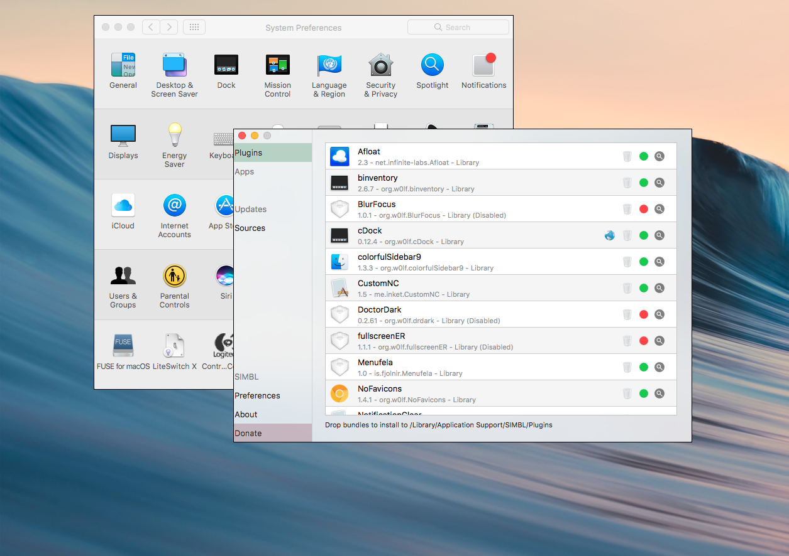

# winBuddy

 

# Information:

- Designed for 10.9+   
- winBuddy is a SIMBL plugin that stylizes application window on macOS 
- Author: [w0lfschild](https://github.com/w0lfschild)

# functionality:

- Hide/Show window Shadow
- Hide/Show window Title Bar
- Hide/Show Menubar Bar and Dock when application is active
- Add window border
    - window border changes color for active window

# Note:

- Some applications may look odd
- Some applications are blacklisted by default including Notification Center and LoginWindow
- winBuddy functionality is controlled form the window menu in individual applications

# Installation:

1. Download [mySIMBL](https://github.com/w0lfschild/app_updates/raw/master/mySIMBL/mySIMBL_master.zip)
2. Download [winBuddy](https://github.com/w0lfschild/winBuddy/raw/master/build/winBuddy.bundle.zip)
3. Unzip downloads
4. Open `winBuddy.bundle` with `mySIMBL.app`
5. Restart any application to have winBuddy plugin loaded

### License:
Pretty much the BSD license, just don't repackage it and call it your own please!    
Also if you do make some changes, feel free to make a pull request and help make things more awesome!
